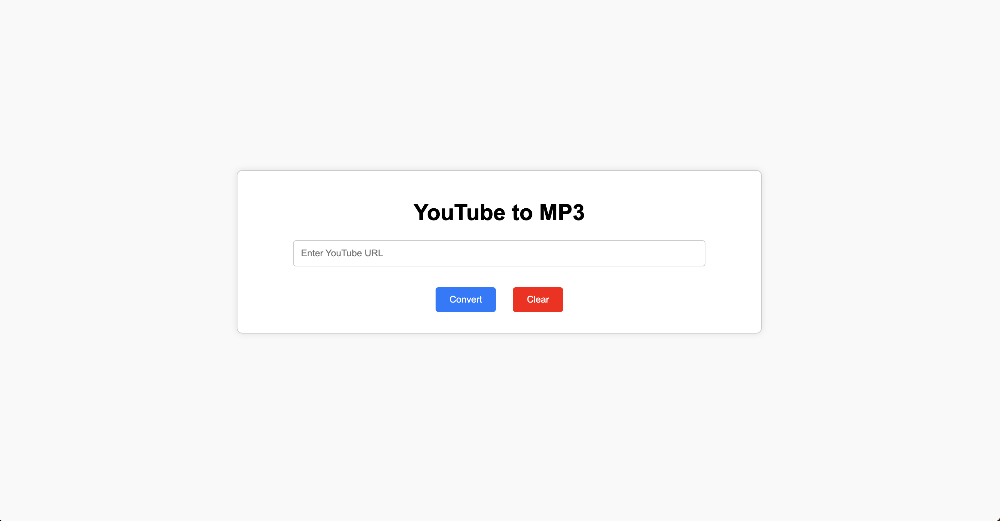

# youtube-to-mp3

<div style="text-align: center;">
    
</div>

## How to Run
```
git clone https://github.com/liangyu0516/youtube-to-mp3.git
cd converter
python3 -m venv venv
source venv/bin/activate
pip install -r requirements.txt
python manage.py makemigrations && python manage.py migrate
python manage.py runserver
```

The application can be accessed at `http://127.0.0.1:8000/`.